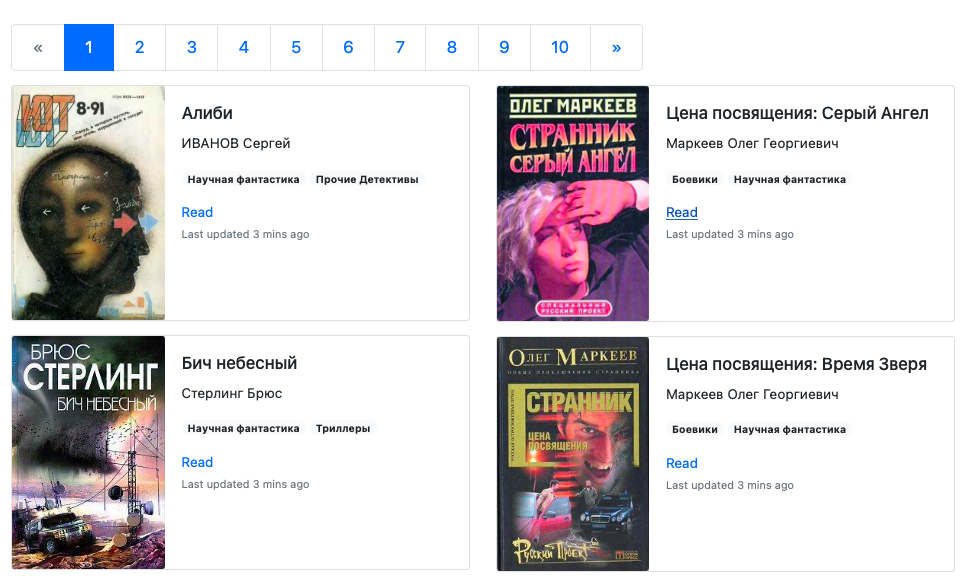

# Library-parser #

## Description ##

The scripts in the repository parse data from the [tululu.org](https://tululu.org/) site by book IDs or by category.

## How to install? ##

Python3 should be already installed. 
Then use `pip` (or `pip3` for Python3) to install dependencies:

```commandline
pip install -r requirements.txt
```

Recommended using [virtualenv/venv](https://docs.python.org/3/library/venv.html)

## Launch ##
### parse_tululu.py ###
This script downloads books of any category by selecting id-books.
The script supports optional arguments that can be selected:

```commandline
-s, --start_id -- Starting range of IDs to download. Default=1.
-e, --end_id -- Ending range of IDs to download. Default=10.
-d, --dest_folder -- The path where the parsing result will be recorded. Default='CWD'.
-i, --skip_imgs -- Allows you not to download images if it's True. Default=False.
-t, --skip_txt -- Allows you not to download books if it's True. Default=False.
```

Run the script to download books and pictures by IDs:
  ```commandline
  python parse_tululu.py
  ```

### parse_tululu_category.py ###
This script loads all the books of the selected category.
The script supports optional arguments that can be selected:

```commandline
-s, --start_id -- Start page range. Default=1.
-e, --end_id -- End page range. Default=1.
-c, --category_id -- ID of the book category. Default=55('Science fiction').
-d, --dest_folder -- The path where the parsing result will be recorded. Default='CWD'.
-i, --skip_imgs -- Allows you not to download images if it's True. Default=False.
-t, --skip_txt -- Allows you not to download books if it's True. Default=False.

```
Run the script to download books and pictures by category:
  ```commandline
  python parse_tululu_category.py
  ```

### render_website.py ###

The script will create and run the site localy using `template.html` and  `books_info.json` files.

Run the script:
```commandline
python3 render_website.py
```
An example of site work can be seen at the [Library_parser]().



=========================================================

## Project Goals ##

The code is written for educational purposes - for a course on Python and web development on the [Devman](https://dvmn.org).
